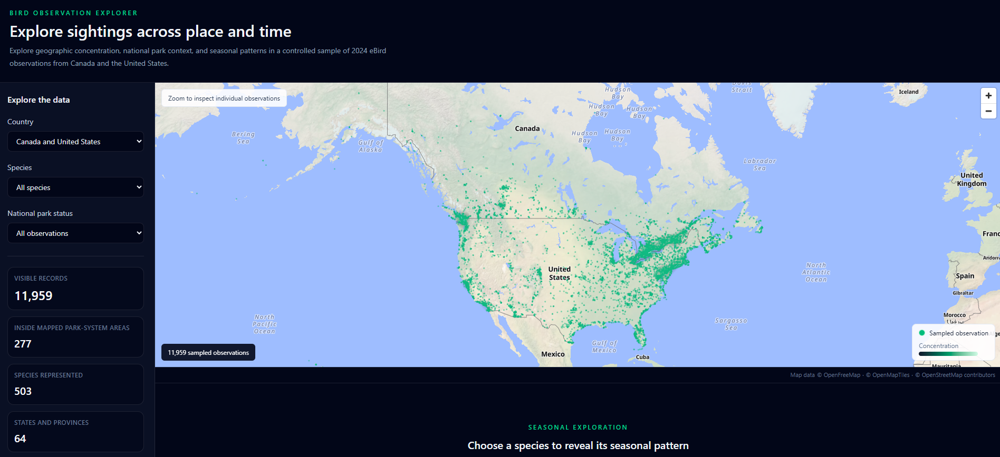
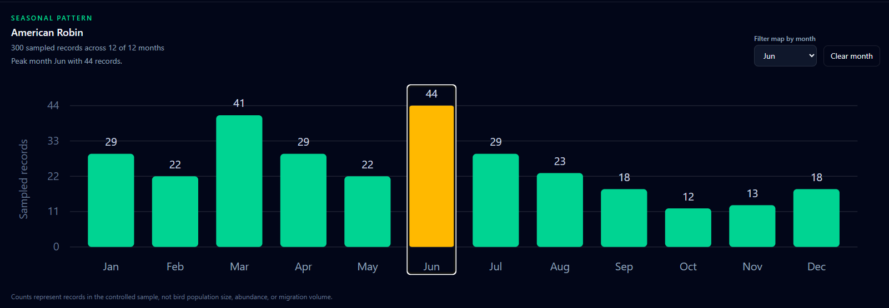

# Bird Observation Explorer

An interactive geospatial application for exploring sampled 2024 eBird
observations across Canada and the United States.

[Live application](https://mcca0711.github.io/bird-observation-explorer/)



## Overview

Bird Observation Explorer combines ecological occurrence records, park-system
boundaries, browser-based analytics, and interactive visualization.

Users can:

- Explore geographic observation density
- Zoom from regional patterns to individual records
- Filter by country, species, month, and mapped park-system context
- Inspect individual observation details
- Compare monthly records for a selected species
- Identify observations located inside mapped park-system areas

The bundled dataset contains 11,959 validated observation records. A GeoPandas
point-in-polygon analysis identified 277 records inside mapped Canadian or
United States park-system boundaries.

## Application architecture

```text
GBIF occurrence API
        |
        v
Python acquisition and validation
        |
        v
GeoPandas spatial join
        |
        v
GeoParquet snapshot
        |
        v
DuckDB WASM browser query
        |
        v
Vue filters and state
        |
        +------------------+
        |                  |
        v                  v
MapLibre and Deck.gl      D3 monthly chart
```

The browser does not repeatedly download and clean records from GBIF. Python
creates a validated GeoParquet snapshot before deployment, and DuckDB WASM
queries that snapshot directly inside the browser.

A version-pinned DuckDB worker is served as a static application asset. The
application closes its DuckDB connection and terminates the worker after the
dataset has been loaded.

## Technology

### Frontend

- Vue 3
- TypeScript
- Vite
- Tailwind CSS
- MapLibre GL JS
- Deck.gl
- D3
- DuckDB WASM

### Data pipeline

- Python
- Requests
- pandas
- GeoPandas
- PyArrow
- GeoParquet

### Quality assurance

- ESLint
- Prettier
- Ruff
- pytest
- Vitest
- Vue Test Utils
- TypeScript compile checking
- GitHub Actions

## Geospatial processing

The Python pipeline:

1. Requests a controlled 2024 sample from the GBIF occurrence API
2. Restricts records to Canada and the United States
3. Validates coordinates, dates, identifiers, and country codes
4. Removes duplicate occurrence identifiers
5. Converts observation records into GeoPandas point geometry
6. Normalizes all spatial data to EPSG:4326
7. Performs a point-in-polygon spatial join
8. Preserves overlapping boundary names without duplicating observations
9. Writes the final dataset to GeoParquet
10. Validates the temporary output before atomically replacing the published file

Network requests use timeouts, retry limits, exponential backoff, page limits,
a descriptive user agent, and an overall record limit.

Only approved output fields are written to the published dataset.

## Reference-data acquisition

The repository includes a separate Python script for downloading the Canadian
and United States park-system boundary datasets.

The script:

- Downloads both datasets from official government spatial services
- Uses request timeouts and retry limits
- Enforces a maximum response size
- Validates the GeoJSON structure
- Checks required name fields
- Accepts only polygon and multipolygon geometry
- Confirms EPSG:4326
- Validates temporary files before replacing existing data

The reference files are excluded from Git and can be recreated when needed.

## Visualization decisions

### Density-first map

At broad zoom levels, Deck.gl displays a heatmap so that regional concentration
can be understood without rendering thousands of competing markers.

Individual observations become selectable after the user zooms closer.

### Monthly bars

Monthly records are shown as bars because months are separate categories.

A smooth line could incorrectly imply continuous movement between months.
Whole-number axis labels are used because observation records cannot be
fractional.

Small samples receive a visible warning, and tied peak months are reported
together.



### Park-system context

GeoPandas checks whether each observation point falls inside:

- Canadian national park, national park reserve, national urban park, or
  Saguenay-St. Lawrence Marine Park boundaries
- United States National Park Service unit boundaries

These boundaries do not represent every protected area in either country.

## Data sources

### Bird observations

EOD - eBird Observation Dataset  
Cornell Lab of Ornithology, accessed through GBIF

- Dataset:
  https://www.gbif.org/dataset/4fa7b334-ce0d-4e88-aaae-2e0c138d049e
- DOI:
  https://doi.org/10.15468/aomfnb

### Canadian boundaries

National Parks and National Park Reserves of Canada Legislative Boundaries  
Natural Resources Canada

https://open.canada.ca/data/en/dataset/9e1507cd-f25c-4c64-995b-6563bf9d65bd

Licensed under the Open Government Licence - Canada.

### United States boundaries

Administrative Boundaries of National Park System Units  
National Park Service Land Resources Division

Official ArcGIS FeatureServer:

https://services1.arcgis.com/fBc8EJBxQRMcHlei/arcgis/rest/services/NPS_Land_Resources_Division_Boundary_and_Tract_Data_Service/FeatureServer/2

Reference metadata:

https://irma.nps.gov/DataStore/Reference/Profile/2316744

### Basemap

- OpenFreeMap
- OpenMapTiles
- OpenStreetMap contributors

Attribution is displayed directly beneath the map.

## Run locally

### Requirements

The project is tested with:

- Node.js 24
- npm 11
- Python 3.13

### Install frontend dependencies

```bash
npm ci
```

### Create the Python environment

```bash
python -m venv .venv
```

Windows PowerShell:

```powershell
.\.venv\Scripts\python.exe -m pip install -r requirements.txt
```

macOS or Linux:

```bash
./.venv/bin/python -m pip install -r requirements.txt
```

### Start the application

```bash
npm run dev
```

The committed GeoParquet snapshot allows the application to run without
rebuilding the source data.

## Rebuild the dataset

Download and validate the official Canadian and United States park-system
boundaries:

```powershell
.\.venv\Scripts\python.exe scripts\download_reference_data.py
```

Generated reference files:

```text
data/reference/canada_national_parks.geojson
data/reference/us_national_park_system.geojson
```

Build the GeoParquet observation snapshot:

```powershell
.\.venv\Scripts\python.exe scripts\build_dataset.py
```

Generated output:

```text
public/data/observations.parquet
```

## Testing and code quality

Check Python linting:

```powershell
.\.venv\Scripts\python.exe -m ruff check scripts tests
```

Check Python formatting:

```powershell
.\.venv\Scripts\python.exe -m ruff format --check scripts tests
```

Run the Python tests:

```powershell
.\.venv\Scripts\python.exe -m pytest -q
```

Check Vue and TypeScript linting:

```bash
npm run lint
```

Check frontend formatting:

```bash
npm run format:check
```

Run the frontend tests:

```bash
npm test
```

Run TypeScript compile checking and the production build:

```bash
npm run build
```

GitHub Actions runs linting, formatting, tests, TypeScript checking, and the
production build before deployment.

## Production scaling path

The current release uses a controlled 11,959-record GeoParquet snapshot. This
is appropriate for a focused application and can be queried efficiently in the
browser without operating a backend.

A production-scale version supporting broader eBird coverage would preserve
the current visualization components while changing the data-delivery
architecture.

Planned scaling work would include:

- Partitioned GeoParquet for broader species coverage and multi-year datasets
- Query pushdown so only requested species, dates, and geographic areas load
- PMTiles or another vector-tile format for high-volume observation layers
- Server-side spatial queries through DuckDB, PostGIS, or a managed analytical
  service
- Progressive loading and caching for global map navigation
- Multi-year comparisons and uncertainty-aware trend summaries
- Raster processing for suitable abundance or distribution products
- User-supplied boundary analysis
- Performance budgets and deployed-site monitoring

These capabilities are documented as future architecture rather than presented
as features already implemented.

## Data limitations

This project uses a controlled sample of reported observations.

The results do not represent:

- Complete eBird coverage
- Bird population size
- Species abundance
- Individual migration routes
- Every protected area in Canada or the United States

The acquisition pipeline applies a fixed monthly sampling limit. An
all-species monthly chart would mostly reflect that collection limit, so the
seasonal chart appears only after a species is selected.

Point-in-polygon results also depend on the accuracy of submitted coordinates
and the boundary datasets available when the snapshot was created.

The heatmap represents the concentration of sampled records. It does not
represent bird abundance or population density.

## Project structure

```text
.github/
  workflows/
    deploy.yml

docs/
  app-overview.png
  seasonal-chart.png

public/
  data/
    observations.parquet
  vendor/
    duckdb/
      duckdb-browser-mvp.worker-1.32.0.js

scripts/
  build_dataset.py
  download_reference_data.py

src/
  components/
    ObservationMap.vue
    TimelineChart.vue
  App.vue
  data.ts
  main.ts
  style.css

tests/
  TimelineChart.test.ts
  test_build_dataset.py
  vue-shim.d.ts

eslint.config.js
pyproject.toml
vite.config.ts
```

## Deployment

Pushes to `main` trigger GitHub Actions.

The workflow:

1. Installs Python dependencies
2. Checks Python linting and formatting
3. Runs the Python tests
4. Installs frontend dependencies
5. Checks Vue and TypeScript linting
6. Checks frontend formatting
7. Runs the frontend tests
8. Performs TypeScript compile checking and the production build
9. Publishes `dist` to GitHub Pages

## License

The application source code is licensed under the MIT License.

The observation data, boundary datasets, and basemap are not covered by the
MIT License. They remain subject to their original source terms and attribution
requirements.
